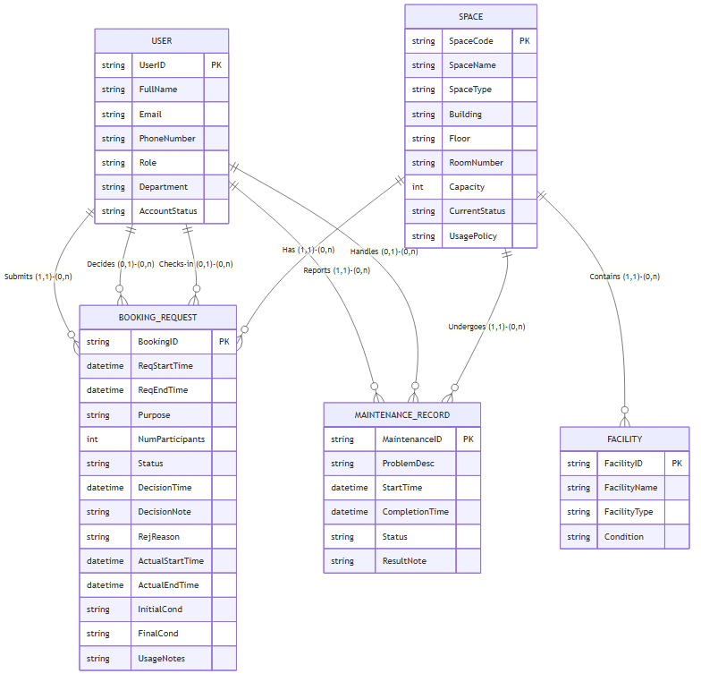

# 02 - Conceptual Database Design (ERD)

## 1. Entities and Attributes (Thực thể và Thuộc tính)
Dựa trên phân tích nghiệp vụ, dưới đây là các thực thể và thuộc tính của hệ thống. Khóa chính (Primary Key - PK) được gạch dưới hoặc đánh dấu rõ ràng nhằm phân biệt từng thực thể:

*   **USER** (Người dùng)
    *   **<u>UserID</u>** (PK)
    *   FullName
    *   Email
    *   PhoneNumber
    *   Role (Student, Lecturer, TA, Facility Staff, Dept Admin, Facility Manager)
    *   Department
    *   AccountStatus (Active, Suspended...)

*   **SPACE** (Không gian/Phòng)
    *   **<u>SpaceCode</u>** (PK)
    *   SpaceName
    *   SpaceType (Classroom, Lab, Meeting room, Auditorium)
    *   Building
    *   Floor
    *   RoomNumber
    *   Capacity
    *   CurrentStatus (Available, In Use, Maintenance, Closed)
    *   UsagePolicy

*   **FACILITY** (Thiết bị/Tiện ích trong phòng)
    *   **<u>FacilityID</u>** (PK)
    *   FacilityName
    *   FacilityType (Projector, AC, Whiteboard, PC...)
    *   Condition (Good, Broken)

*   **BOOKING_REQUEST** (Yêu cầu đặt phòng)
    *   **<u>BookingID</u>** (PK)
    *   ReqStartTime
    *   ReqEndTime
    *   Purpose
    *   NumParticipants
    *   Status (Pending, Approved, Rejected, Cancelled, No-show, Completed)
    *   DecisionTime (thời gian duyệt/từ chối)
    *   DecisionNote
    *   RejReason
    *   ActualStartTime (thời gian check-in thực tế)
    *   ActualEndTime (thời gian check-out thực tế)
    *   InitialCond (Tình trạng phòng lúc nhận)
    *   FinalCond (Tình trạng phòng lúc trả)
    *   UsageNotes

*   **MAINTENANCE_RECORD** (Hồ sơ bảo trì)
    *   **<u>MaintenanceID</u>** (PK)
    *   ProblemDesc
    *   StartTime
    *   CompletionTime
    *   Status (Reported, In Progress, Resolved)
    *   ResultNote

## 2. Relationships and Cardinalities (Mối quan hệ và Bản số tham gia)
Sử dụng ký hiệu `(min, max)` để biểu diễn số lượng tối thiểu và tối đa các thực thể tham gia vào một mối quan hệ:

1.  **USER - BOOKING_REQUEST (Submits / Gửi yêu cầu)**
    *   Một `USER` có thể gửi 0 hoặc nhiều `BOOKING_REQUEST` $\rightarrow$ `(0, n)`.
    *   Một `BOOKING_REQUEST` bắt buộc do đúng 1 `USER` gửi $\rightarrow$ `(1, 1)`.

2.  **USER - BOOKING_REQUEST (Decides / Phê duyệt)**
    *   Một `USER` (quản lý) có thể duyệt 0 hoặc nhiều `BOOKING_REQUEST` $\rightarrow$ `(0, n)`.
    *   Một `BOOKING_REQUEST` được duyệt bởi tối đa 1 `USER` (có thể chưa ai duyệt lúc chờ) $\rightarrow$ `(0, 1)`.

3.  **USER - BOOKING_REQUEST (Checks-in/out / Làm thủ tục)**
    *   Một `USER` (nhân viên) có thể làm thủ tục check-in/out cho 0 hoặc nhiều `BOOKING_REQUEST` $\rightarrow$ `(0, n)`.
    *   Một phiên sử dụng (`BOOKING_REQUEST`) được làm thủ tục bởi tối đa 1 `USER` $\rightarrow$ `(0, 1)`.

4.  **SPACE - BOOKING_REQUEST (Has / Có lượt đặt)**
    *   Một `SPACE` có thể có 0 hoặc nhiều `BOOKING_REQUEST` $\rightarrow$ `(0, n)`.
    *   Một `BOOKING_REQUEST` chỉ đặt đúng 1 `SPACE` $\rightarrow$ `(1, 1)`.

5.  **SPACE - FACILITY (Contains / Chứa thiết bị)**
    *   Một `SPACE` có thể chứa 0 hoặc nhiều `FACILITY` $\rightarrow$ `(0, n)`.
    *   Một cụm thiết bị cụ thể (`FACILITY`) nằm ở đúng 1 `SPACE` $\rightarrow$ `(1, 1)`.

6.  **SPACE - MAINTENANCE_RECORD (Undergoes / Bảo trì)**
    *   Một `SPACE` có thể có 0 hoặc nhiều `MAINTENANCE_RECORD` $\rightarrow$ `(0, n)`.
    *   Một `MAINTENANCE_RECORD` áp dụng cho đúng 1 `SPACE` $\rightarrow$ `(1, 1)`.

7.  **USER - MAINTENANCE_RECORD (Reports / Báo cáo sự cố)**
    *   Một `USER` có thể báo cáo 0 hoặc nhiều `MAINTENANCE_RECORD` $\rightarrow$ `(0, n)`.
    *   Một `MAINTENANCE_RECORD` do đúng 1 `USER` báo cáo $\rightarrow$ `(1, 1)`.

8.  **USER - MAINTENANCE_RECORD (Handles / Xử lý bảo trì)**
    *   Một `USER` (nhân viên) được phân công xử lý 0 hoặc nhiều `MAINTENANCE_RECORD` $\rightarrow$ `(0, n)`.
    *   Một `MAINTENANCE_RECORD` được giao cho tối đa 1 `USER` xử lý $\rightarrow$ `(0, 1)`.

## 3. ER Diagram (Biểu diễn Sơ đồ)

