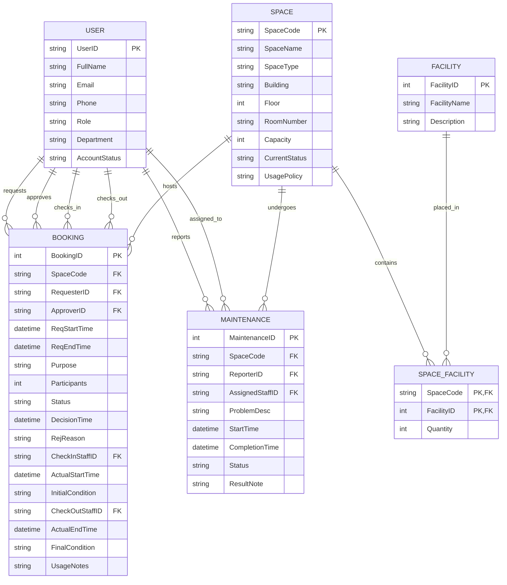

# Conceptual Design / ERD

## Entities & Attributes
- **USER**: UserID (PK), FullName, Email, Phone, Role, Department, AccountStatus
- **SPACE**: SpaceCode (PK), SpaceName, SpaceType, Building, Floor, RoomNumber, Capacity, CurrentStatus, UsagePolicy
- **FACILITY**: FacilityID (PK), FacilityName, Description
- **BOOKING**: BookingID (PK), SpaceCode (FK), RequesterID (FK), ApproverID (FK), CheckInStaffID (FK), CheckOutStaffID (FK), ReqStartTime, ReqEndTime, Purpose, Participants, Status, RejReason, DecisionTime, ActualStartTime, InitialCondition, ActualEndTime, FinalCondition, UsageNotes
- **MAINTENANCE**: MaintenanceID (PK), SpaceCode (FK), ReporterID (FK), AssignedStaffID (FK), ProblemDesc, StartTime, CompletionTime, Status, ResultNote

## Relationships & Cardinality
- A USER can make multiple BOOKINGs (1:N)
- A SPACE can have multiple BOOKINGs (1:N)
- A USER (Staff) can approve/check-in/check-out multiple BOOKINGs (1:N)
- A SPACE has a many-to-many relationship with FACILITY (N:M), resolved by SPACE_FACILITY
- A SPACE can have multiple MAINTENANCE records (1:N)
- A USER can report or be assigned to multiple MAINTENANCE records (1:N)

## ERD Diagram

